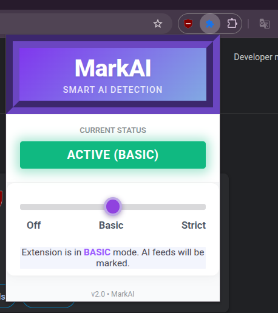

# MarkAI - AI Image Detection Chrome Extension
MarkAI is a Chrome extension that can identify, flag & remove images that feels like AI-Generated in real-time while browsing. This helps a user distinguish AI‑generated content from natural images without significantly disrupting normal page interaction.

## Features
- Automatically scans images on the web pages as you scroll
- **Dual Detection Modes**:
    - Basic Mode: Adds grey overlays with "AI" labels to detected artificial images.
    - Strict Mode: Completely hides AI-generated images from view.
- Utilizes a local FastAPI server with ONNX runtime for accurate classification
- Efficient viewport-based processing with scroll optimization using MutationObserver & IntersectionObserver.

## Deployment Guide (Python 3.9+, Chrome 116+)

1. Clone the repository

2. Set up the AI server:
    - Install all necessary dependencies using the following commands:
    ```
    #Ensure current directory is ai-flagger-server
    python3 -m venv venv
    .\venv\Scripts\Activate.ps1    #for Linux bash: source venv/bin/activate
    pip install -r requirements.txt
    ```

3. Download any latest general use AI detector model you can find on hugging face and use Optimum to convert it to `ONNX` format, and place the onnx model file in `ai-flagger-server/models/`.

4. Either run the python file or enter uvicorn command:
```
uvicorn server:app --reload --host 127.0.0.1 --port 8000
```

5. Inside Chrome, navigate to `chrome://extensions`, enable Developer Mode and Load `ai-image-flagger` folder.

**NOTE: Adblockers or similar extensions can block it from working properly, so disable them temporarily.**

6.  Navigate to google images or any popular image libraries and try it out!

7. Click on the extension to open the MarkAI Control Panel:

    

## Privacy \& Security

- Edge Preprocessing: All images are cropped and resized to 224x224 locally within the browser's Offscreen Canvas before being sent for analysis.
- MarkAI operates within a local environment at 127.0.0.1:8000 i.e. never leaving your physical machine, which means no search tracking or data mining.
- Extension uses an in-memory Map to store detection results for the current session which is cleared with browser restart.
- Extension defaults to a "Neutral" state to avoid UI breaking, ensuring a stable browsing experience.

# MARKAI v2.0 Changelogs
- (Two Layer Approach): We combined ML model logic with Frequency Domain Analysis (FFT). By looking at the frequency spectrum, MarkAI can now flag those AI images that might trick a standard neural network.
- To ensure almost-instant detection, the extension now crops and resizes images locally using the Chrome Offscreen API before it even hits the server. (Chrome 116+ feature).
- Strict Mode Revamped: instead of completely eliminating the image+holder, it gets  a subtle white overlay...This is to ensure browsing stability and to eliminated UI breaking.
- fixed CORS issues by refactoring image fetching; now using Blob-to-Base64 pipeline in the background service workier.

## License

<<<<<<< HEAD
This project is licensed under the GPL-3.0 License - see the [LICENSE](LICENSE) file for details.
=======
This project is licensed under the GPL License - see the [LICENSE](LICENSE) file for details.
>>>>>>> e74ec8c (VERSION 2.0)

***
